# IDS6145(SimTech 2018) - Research Plan

> * Group Name: Ama-Drone
> * Group participants names: Markus Loennig, Marc Mailloux, Tiffani Marlowe
> * Project Title: Viability of Drone Delivery in Orlando Fl

## General Introduction

Technology and online shopping continues to advance at an instantaneous rate. Consumers are now capable of ordering most anything via the web and therefore, have become reliant on quick and dependable home delivery services. With the online shopping market increasing at a steadfast rate, businesses are now investigating and improving new forms of delivery and their overall efficiency. One of the most recent forms of delivery are via aviation, in particular, by the use of drones.
A "drone" refers to an unmanned aerial vehicle (UAV) or unmanned aerial system (UAS) – meaning while in flight the drone is controlled remotely by an operator on the ground. Currently aviation technology is shifting from typical within cockpit control to UAS. Pilots main task is to monitor the UAV from the ground instead of physically being in control from inside the cockpit. In doing so, the pilot is removed from manual control and systems operations in various scenarios. This ability greatly reduces operator workload and safety while also enabling pilots to operate multiples systems simultaneously.  

Traditionally, drones have been utilized within the military for dangerous operations and missions to limit solider causalities. Drones enables the military to complete missions that otherwise would not be possible due to constrains such as flight-time and endurance. More recently, drones are beginning to be utilized in many civil applications such as firefighting and even now, package delivery.  Through the operation of drone delivery, there could be potential for reduced delivery costs, improved customer service and more importantly, accelerated delivery times. 

The ability to keep up with developing technology and the adaption of regulations (airspace, legal, insurance, etc.) are already in the works. Many large online retailers such as Amazon and DHL are currently experimenting with unmanned aerial systems in order to provide faster delivery of consumer goods. Amazon plans to implement "Amazon Prime Air" with a targeted delivery time for certain goods in under 1 hour. In addition to Amazon, other delivery and logistics companies are currently testing drone capabilities to determine the efficiency and effectiveness of drone package delivery. Therefore, it is apparent that delivery (among other areas) via drone technology is something we can expect to see in the future. We feel this form of delivery will quickly become the next level of packaged delivery throughout the world due to its ability to provide faster and more efficient deliveries. 

#### Historical Background:
Before the digital era (Internet) consumer needs were usually satisfied by local department and specialty stores. Uncommon goods were ordered from catalogues either via phone (landline) and/or via a written order (letter). Once the packaged has been processed by the retailer, a distribution center somewhere in the country would further process the order and a mailman would later deliver the package to its destination. Consumers could expect to receive their order within two weeks which was considered normal at the time.

With the coming of the digital era, consumers no longer have to physically go into stores or use catalogues to purchase goods. Instead, they are capable of ordering most anything via online shopping. With these evolving abilities, consumer behaviors and expectations have also changed. They now demand their orders sooner rather than later. This impatience and expectation has only worsened over time. Larger retailers are now forced to manage this decentralized demand by providing quicker and more efficient delivery methods.

One of that largest online retailers, Amazon, has managed to change the worldwide behavior and meet consumer expectations by ensuring everything is connected. Therefore, everything is accessible by the click of a button. Amazon, has continued to decrease delivery times from weeks to now days. They have even gone further enough to shorten the delivery time of certain goods to "Next Day" and most recently to "1 Hour" delivery. They have made this possible by building smart distribution centers in various locations and implementing a highly intelligent delivery process. Without a sound and sophisticated delivery infrastructure, this worldwide success would not be possible.

Amazon and others major retailers are investigating the next step: overcoming the delivery infrastructure and service (like American Postal Service or UPS/DHL) with their own, more efficient and fast system. The newest logical solution lays within air transportation. Its direct and is not dependent upon on street infrastructure or the control of a human. Therefore, the number of employees and the time between package processing and delivery will be decreased. Potentially allowing for greater savings for both the retailer and the consumer.

Drone technology on the other hand has also become more advanced over the past few years. They are now equipped with better batteries due to higher density, improved charging times, more efficient brushless motors and a certain degree of independence to perform a variety of tasks. Thus, the capabilities of drones are influencing and expanding the delivery industry. Drone delivery systems are already scalable for different scenarios. Uber is experimenting with drones in terms of a taxi service, which is, from a logistical stand point of view, very similar to an on-time package delivery system. 

#### Problem Statement
Based on current technology and consumer needs, we believe that drones will provide a more efficient and especially faster form of consumer goods package delivery throughout the world. Therefore, in this article, we aim to investigate whether a drone delivery system could be realistic and overall beneficial to a larger city such as Orlando, Florida. 

This research contributes to the current technological advancement by providing relevant insight on how a drone delivery system would have to be designed in order to run successfully and efficiently. Our research compares statistics for both current and advanced delivery systems to determine their effects on delivery time and scale of effort. In addition, we provide an empirical analysis to further highlight the potential of a future drone based delivery system and answer to current urgent questions and consumer expectations on delivery time.

By simulating the effects of varying number of drones, charging times, and flights speeds we hope to determine 1) how many drones would be necessary (scale of effort) to service a given area and 2) how cost efficient a drone delivery system would be.

We hypothesize:

1.)	Drone delivery will be able to improve delivery time to under one hour (e.g. Amazon Prime Air), given the customer lives within a certain distance to a "distribution center" and is able to receive a package from a drone. 

2.) Improved battery life and speed will significantly reduce the overall number of drones needed. Therefore, reducing the logistical footprint and costs for the respective logistical company - making it easier, cheaper and more probable to implement. 

## The Model
In order to represent and depict all aspects of the simulated drone delivery system, we have created (refined from our previous Transportation Simulation Model) multiple Object and Behavioral Diagrams. This enables us to describe both simulations (Anylogic and Python) from a model perspective. Each system offers a unique approach to answering the same fundamental questions stated below.

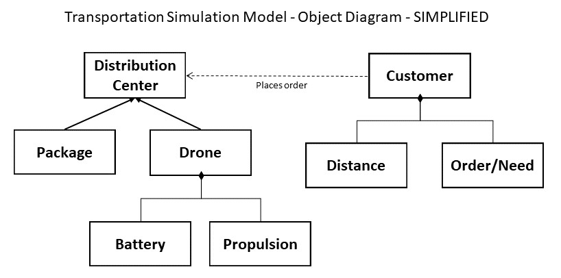

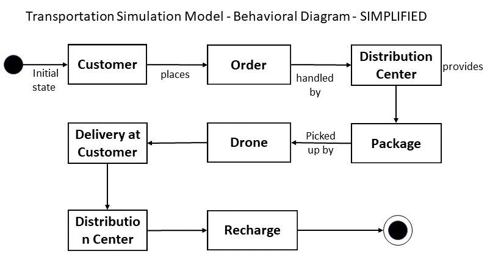

Object Diagram (Figure 1) and Behavior Diagram (Figure 2) shown above represent the Anylogic simulation that focuses on answering questions related to drone optimization and utilization from an Agent Based perspective. Figure 1 describes the various objects in the simulation and their attributes in which we will be focusing our attention (battery life, propulsion, etc.). Within Figure 2, the interactions between the variables and how the simulation will be executed is depicted. Gathered from the models, you can see that the initial state starts with the customer. When customers place an order, the order is then sent to a distribution center where the package will be handled and later picked up by a drone to be delivered. Once the drone has delivered the package to the customer, it returns to the distribution center to recharge until the process starts again.

#### PYTHON OBJECT DIAGRAM HERE (Figure 3)
#### PYTHON BEHAVIOR DIAGRAM HERE (Figure 4)

While Object Diagram (Figure 3) and Behavior Diagram (Figure 4) shown above represent the Python simulation that focuses on individual drone utilization and efficiency from a Discrete system perspective.

(MORE DESCRIPTION NEEDED)

Both models have been created based on current delivery technology systems and then tweaked specifically for drone usage. For the purpose of this experiment we focus our attention on simulating various input and output variables within each system. For a greater understanding, they are listed below:

+	drone delivery methods
+	battery life
+	propulsion
+	speed of delivery
+	number of drones

## Fundamental Questions
By implementing both an Agent Based (Anylogic – Model 1) and Discrete Simulation (Python – Model 2), we aim to answer each of the following questions below: 
##### 1) Is drone delivery efficient as an air based delivery method? If so,
+ How long does it take (on average) to deliver a package to a certain location by air?
+ How will efficiency change with increasing number of orders and diversified locations?
+ How long does it take to deliver 50 packages via air based system?

##### 2) How does increased battery and max speed effect utilization, arrival time and the number of drones needed?

##### 3) Can drones reduce average delivery time to 1 hour (as intended by Amazon Prime Air). If so, 
+ How many drones are necessary to achieve this?

## Research Methods

To address and answer the fundamental questions above, we have developed and executed an Agent Based Simulation within the simulation software Anylogic and a Dicrete Event Simulation in Python. We were able to depict specific areas of the city of Orlando within the simulation by gathering GIS data. Throughout this simulation we hope to evaluate the overall effort needed to partly replace, or at least improve, current ground based methods of delivery and meet future consumer expectations.

In order to do so, we focused our attention on demonstrating how a drone delivery system would be implemented. This approach enables us to determine which scale of effort is needed and also define the quality and quantity of drones it would take to provide an efficient air based delivery system for the intended area. Changing certain parameters on the drone such as battery density, endurance, max speed, charging time, etc. can all help to predict completion estimates for newer technology.

To successfully model a simulation that would answer the fundamental questions above, we had to define certain prerequisites and assumptions beforehand. We defined these prerequisites and assumptions based on the drone market screening we gathered. To meet our expectations and improve the overall validity of the system we chose to use a drone created by DJI company. This company offers the best compromise between carrying power, in other words how much weight it can transport and lift, and endurance. Endurance is an important element within our simulation as it helps define the reach of the drone and overall radius.

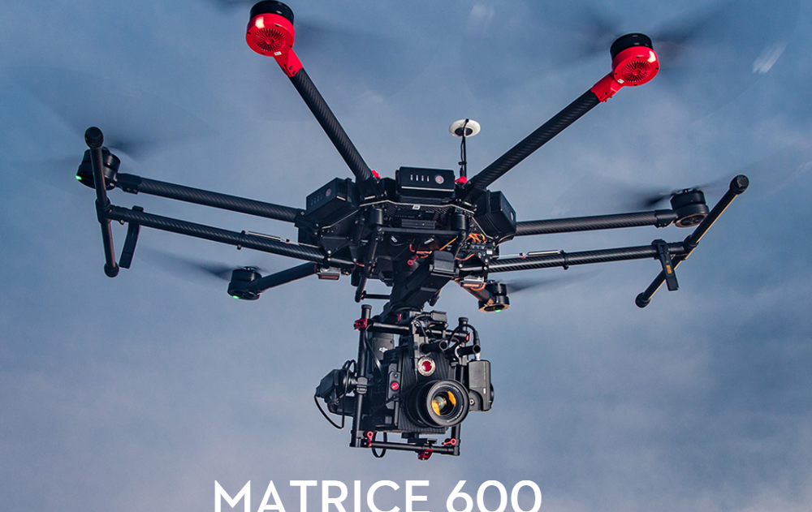

The drone model we chose to base our prerequisites and assumptions on is the DJI Matrice 600 (matrice multiplication which is by pure coincidence the mathematics behind our Python simulation, no pun intended). The Matrice 600 model is built and used for professional users because it offers a high amount of documentation, precise location of coordinates due to its sensor layout (a prerequisite in unmanned/unmonitored flying), its ability to carry up to 5.5kg (12.1 lbs) and ability to travel at speeds up to 40 knots. This capability translates to 40 mph when there is no wind. Due to its retractable landing gear, it could also carry light, oversized packages proving to be an excellent model for our simulations.

For more information on the Matrice 600 drone technical specs, see: https://www.dji.com/matrice600 

To further validate our simulations and provide more realistic data in terms of package weight, size and delivery time, we completed a survey that compared 10 Amazon orders from 4 individuals. In doing so, we concluded that the average package size for delivery is about 10x5x8 inches in length (min size: 5x5x5, max size: 17x10x11) for packages that weighed 4lbs or less. Average delivery time was 2.0 days. We focused on packages of this weight to replicate the simulated drone max weight of 4lbs. For the purpose of the simulation, everything above this weight limited will not be offered for “Air Delivery”.

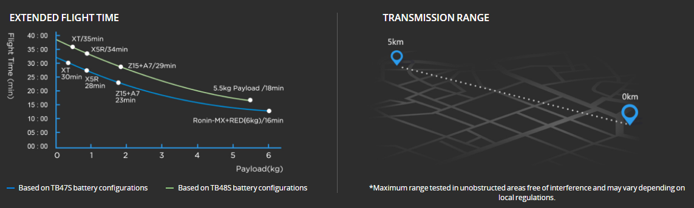

						 Image 3: Matrice 600 Spec Data

#### Prerequisites 

Gathered from the Matrice 600 spec data (shown above: Image 3) and package survey data, we have compiled a list of prerequisites and assumptions that apply to the AnyLogic simulation. Within each of the two models,specific parameters and assumptions have been set to improve system validity and overall system design. Each of the prerequisite and assumption listed below have been met and applied before running the simulations. 

+ Drones fly with an average of 50 ft/second (15m/sec). This applies to drone acceleration and deceleration.
+ Drones are equipped with the TB48S battery configuration. This allows for 30 minutes of endurance for a 4.4 lbs payload/package.  
+ Due to the aforementioned prerequisites, maximum range is limited to 17 miles - allowing for an effective roundtrip radius of 8.5 miles.
+ Recharging battery time for a complete charge is set to 90 minutes (based on 0% to 100%).
+ Drones will be recharged to full capacity after each flight, regardless of the travelled distance and available battery life.
+ Recharge time roughly represents the flight time by a factor of 3. Meaning, a flight time between 3-6 minutes will require a recharging time of 9-18 minutes. 
+ Drones will fly “uncontrolled”. Meaning, there will be no transmission range implemented. Instead, drones will be programmed with address coordinates and flight obstacles (flight profile) prior to the start of the simulation. 

#### Assumptions

+ The effective time from order to loading the drone is a triangular distribution with an average of 7 minutes (minimum of 3 minutes; maximum of 12 minutes). 
+ Unloading a package at the destination is a uniform distribution between 20 and 45 seconds. 
+ No package is heavier than 4 lbs.
+ To provide various distances for the drones to cover and deliver to, the data set is equipped with 13 different addresses that vary in distance.
+ There is one distribution center that prepares the packages and houses the drones
+ The distribution center is responsible for the depicted area that has a diameter of 14.2 miles. We have chosen a smaller than possible (17 miles) diameter to allow room for additional measures such as wind (even minor wind speeds can have huge effects) and potential package drag. 

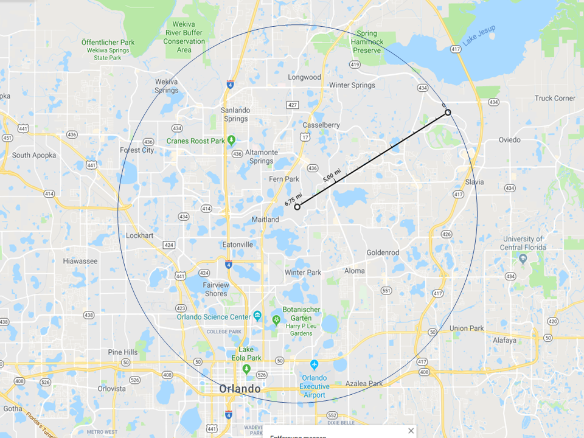
							
                         			 Image 4: Drone Delivery Area

For the purpose of both simulations, we have used a quarter of the depicted area shown in Image 4 since direction has no real effect on the drone's abilities. An address provides the drone with a very important parameter, distance. This then translates into flight time, which is the limiting factor for the drone, thus determining the respective recharging time necessary for delivery. 

#### Research Simulation Design: Anylogic

Below is the simulated design process for the AnyLogic Model. For the purpose of Part 1 of this model, the simulation starts with 5 / 8 / 11 drones for a runtime of 600 minutes (10 hours). Within this runtime, there is only 1 order per household (HH) per hour (13 orders/hour). Here, we aim to determine how drone utalization and optimization varies based on package amount.

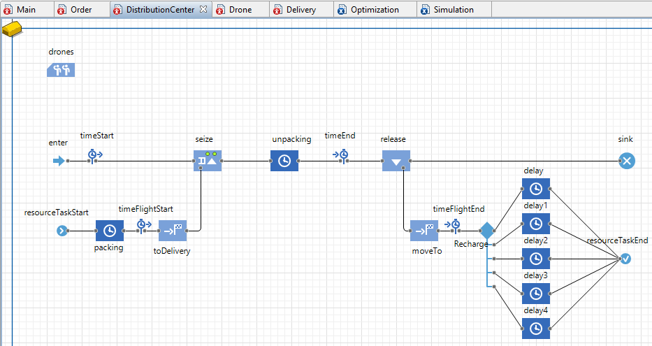

For the second half of thus simulation, we change the speed (in the images below as: "fast") and shorten the charging times of the batteries ("charge"), as this is currently the limiting factor on usage. Lastly, both changes/improvements will be implemented ("both") simultaneously and analyzed.

- "fast": the speed will be adapted to 60 mph (88ft/sec, 29m/sec). Modern drones can achive that speed and are foreseen to be faster, depending on the type of drones. 
- "charge": the charging time will be reduced by 1/3, so now a full charge can be done within 60 minutes (instead of 90 minutes).
- "both": both above described improvements are being implemented into the drone simulation. 

All other values (houses, number of drones, ...) will remain the sane as the first half of the simulation to be able to compare the impact of the attributes Speed and Charge.

Multiple videos of the simulation have been provided below for more insight into each simulated run.

- The process for 1 order/HH/hour with can be seen here: 
	+ https://youtu.be/fzb6oUqDDWY
- 1 order/household/hour  with  5 drones:  utilization 96%,  53 deliveries, of which 21 take longer than 1 hour, 6 even longer than 90 minutes
  + https://youtu.be/HbHV2XxcoAI
- 1 order/household/hour  with  8 drones:  utilization 95%,  81 deliveries, none took longer than 1 hour
  + https://youtu.be/rOAO5Jfjz04
- 1 order/household/hour  with 11 drones:  utilization 81%,  94 deliveries, none took longer than 40 minutes
  + https://youtu.be/vtBSfUZnuog

- The next simulation doubles the number of orders to 2/HH/hour. With 16 and 18 drones the simulation reaches a utilization of 92%, which is above the given threshold for the optimization process assigned in Anylogic. 
	+ https://youtu.be/uKgUKagtmTc
	+ https://youtu.be/in5Zay7Dtjw 

#### Research Simulation Design: Python

Below is the simulated design process for the Python  Model. For this purpose of this model, the simulation starts with 

Object Diagram
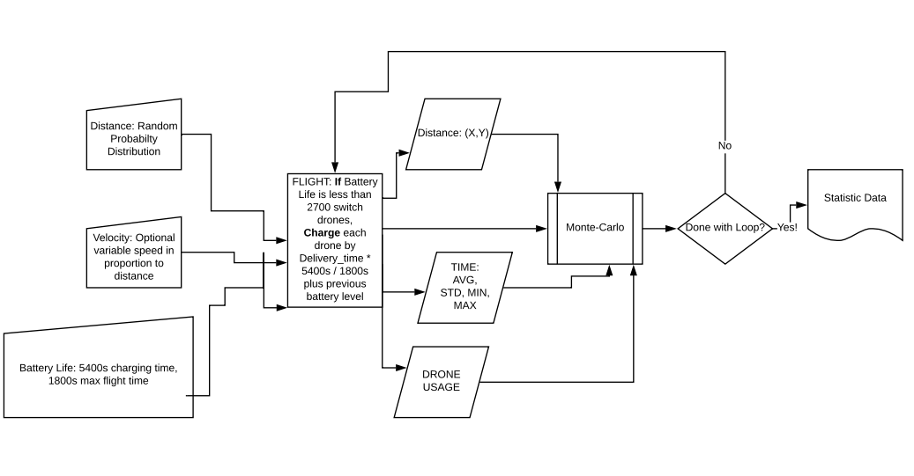

Behavioral Diagram
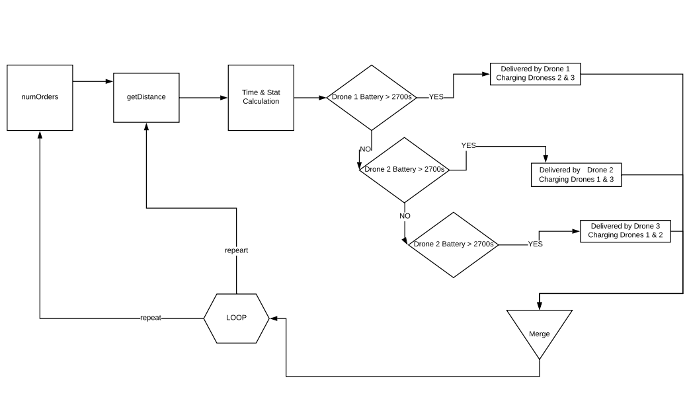

Map of Randomly place "homes"

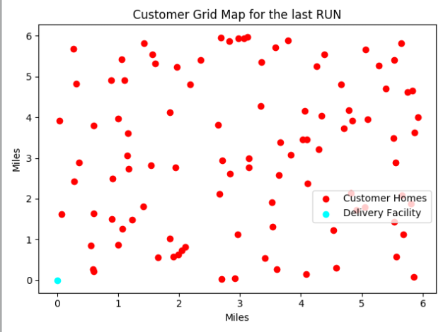

>>> ADD MORE HERE, INSERT SIMULATiON IMAGE >>> 

## Results:

##### Model 1 Results: Anylogic

The maintenance scores for drone delivery utilization, optimization, and time for 1-, 2-, and 3- order/HH/hour in the Anylogic Model 1 were analyzed with a within-subjects design. Where the number of drones varied from 5, 8, and 11 for each amount of delivery per hour. In aviation, a rule of thumb is that for every aircraft you need to employ at all time, you need at least three. Thus, for this simulation the number of drones (5, 8, 11) tripled each time the orders increased from 1, 2 to 3.  After running the simulation, statistics reveled a main effect for 1 order/household/hour, with 11 drones having the most efficient scores (utilization rate = 81%, deliveries = 94, time = < 40 minutes), followed by 18 drones for 2/HH/Hour (utilization rate = 85%, deliveries = ?, time = < 30 minutes), and then finally  25 drones for 3/HH/Hour (utilization rate = 85%, deliveries = ?, time = < ? minutes). An optimization process over 85% is unrealistic due to planned and unplanned maintenance, and room for higher package reserves during peak times. Therefore, the optimization process at which we used, 85% is shown in Figure 1. 

Since the utilization of over 85% is unrealistic, the formulated goal could not be met with 5 and 8 drones. Results showed that due to the high utilization rate there was no time to accept sufficient orders. With 5 drones in use, only 53 packages were delivered compared to 94 deliveries with 11 drones. All 2 package deliveries were completed within 30 minutes of the order, which shows the potential of drone based delivery systems. Interestingly, for 3 packages the number of drones doesn't necessarily equally to the magnitude of orders. The result shows that the optimization is correct. Even simulations with significantly more drones (up to 45) don’t show any significant differences between number of orders served or service time until delivery. The only difference is the utilization time, which drops significantly and is therefore counterproductive (as it is a cost-driver).

There was also a main effect on drone delivery time based on both drone speed (normal, fast) and battery charge. These statistics revealed that a fast speed (60 mph) had a main effect for each reducing drone delivery time for 1 order/HH/Hour (delivery time reduction = 39%), followed by 2 order/HH/Hour (delivery time reduction = 30%), and then finally by 3 order/HH/Hour (delivery time reduction = 9%).  Further inspection of these results revealed that implementing “both” improvements (faster speed and less charge time) for each package amount reduced mean time and max delivery time, 1 order/HH/Hour (reduced mean time = 37%, reduced max delivery time = 54%), 2 order/HH/Hour (reduced mean time = 29%, reduced max delivery time = 43%), and 3 order/HH/Hour (reduced mean time =21%, reduced max delivery time = 32%). Results and descriptive statistics for each package order amount (1, 2, 3) are shown in Figure 2, 3, and 4.

For a further breakdown of the statistics, the changes in the values of charging time, speed and both are described and summarized here. Figure 2 shows the effects on 1 order/HH/hour for the given area and 11 drones. The optimization process shows slight variations in necessary drones:  

  - 1_11 (normal) is 11      
  - 1_11fast is 12     
  - 1_11charge is 9      
  - 1_11both is 9      --> thats a change of 19% from normal to both

Even though the optimization run suggests changing the number of drones, we left them deliberately at the "normal" value to see the difference in the simulation. In Figure 2, the first striking difference (on the right side), as to be expected - the flight time is almost reduced to half. This is logical as the speed almost doubled (34mph --> 60mph). The effect of the increased speed on delivery time is also significant with a mean from 17.7 minutes to 12.5, which is a reduction of almost 30%. The reduced charging time shows its effect on the max delivery time value, as it is also significantly reduced from 37.6 to 22.9 minutes. This is a reduction of 39%. Obviously, implementing both improvements reduce the mean and the max delivery time again, as both can have cumulative or subsidiary effects. Implementing both improvements reduce mean time by 37% and the max delivery time by 54%. 

Figure 3 shows the effects on the 2 order/HH/hour for the given area and 18 drones. The optimization process shows again positive variations in necessary drones (decrease of up to 3, which equals a 17% reduction):  
  - 2_18 (normal) is 18      
  - 2_18fast is 16     
  - 2_18charge is 17     
  - 2_18both is 15     --> thats a change of 17% from normal to both

Again, we left the number of drones at the "normal" value to see the difference in the simulation. As shown in Figure 3 below, the flight time is almost reduced to half. This will always be the case because it is logical as the speed almost doubled (34mph --> 60mph). It will not be mentioned in further discussions. The effect of the increased speed on delivery time in a higher number environment, with more drones and more orders shows again improvements on the mean delivery time from 15.6 minutes to 13.2, which is a reduction of almost 16%. The reduction is smaller, but so is the mean time to begin with. This seems to be a normal effect, as smaller numbers are less tolerant to outlying behavior or problems. In fleet management this is the so called "curse of small numbers".  The reduced charging time again shows its effect best on the max delivery time value, as it is reduced from 31 to 21.7 minutes. This is a reduction of 30%. Implementing both improvements reduce mean time by 29% and the max delivery time by 43%. 

Lastly, Figure 4 shows the effects on 3 order/HH/hour and 25 drones. The optimization process shows again positive variations in necessary drones (decrease of up to 7, which equals a 28% reduction) for a targeted utilization rate of 85%:  
  - 3_25 (normal) is 25      
  - 3_25fast is 25     
  - 3_25charge is 19     
  - 3_25both is 18     --> thats a change of 28% from normal to both!
  
The effect of speed increase on delivery time in an even higher number environment, with more drones and more orders shows again improvements on the mean delivery time, here from 14.2 minutes to 11.4, which is about 20%. This reduction is somewhat higher than for the 2_18 simulation, but it seems to be a normal variation. This seems to be a normal effect, as smaller numbers are less tolerant to outlying behavior or problems. The reduced charging time again shows its effect best on the max delivery time value, as it is reduced from 25.7 to 23.3 minutes. This is only a minor reduction of 9%.  Implementing both improvements reduce mean time from 14.2 to 11.2 minutes (21%) and the max delivery time from 25.8 to 17.6 minutes (32%). 

Video with statistics for 3_25_both on:   https://youtu.be/Bg6cD1Y4d-0

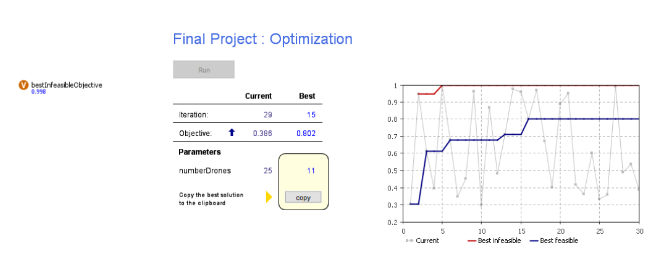

				Figure 1: Optimization  process for 85% threshold

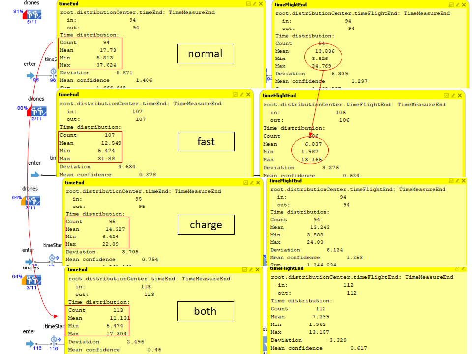

				Figure 2: 1 order/HH/Hour 11 drones

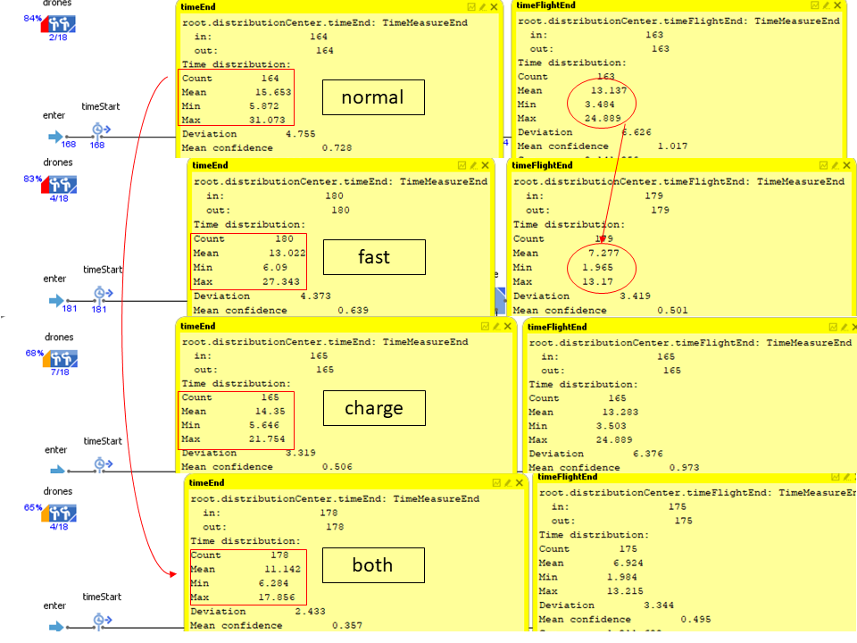

				Figure 3: 2 order/HH/Hour 18 drones

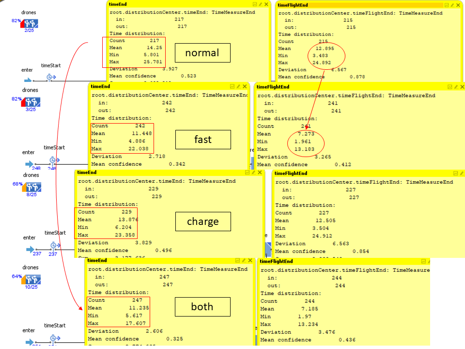

				Figure 4: 3 order/HH/Hour 25 drones

##### Model 2 Results: Python

INSERT FINDINGS HERE

## Discussion
1) Is drone delivery efficient as a air based delivery methods? If so,
+ How long does it take (on average) to deliver a package to a certain location by air?
  - depending on the number of drones and the distance to be travelled usually about 30 minutes (with the prerequisites and assumptions formulated above). That is when the optimal number of drones is found for the actual demand with a utilization rate not higher 85%.
+ How will efficiency change with increasing number of orders and diversified locations?
  - the number of orders have an immediate effect on the number of drones needed to keep the timelines under 1 hour. At a certain point, the orders can not be fulfilled in time and will lead to a cascade of unfulfilled orders (see example above with 1 order/HH/hour and 5 drones).
+ How long does it take to deliver 50 packages via air based system?
  - that depends on the rate of incoming orders and on the available drones in the distribution center. With a rate of 3 orders/HH/hour, it takes about 140 minutes, given the number of drones is about 25.
  
3) Can drones reduce average delivery time to 1 hour (as intended by Amazon Prime Air), how much drones are neccessary? 
   - Yes, they can and it is dependant on the number of orders the systems is prepared for. 

#### Questions answered for this part:

2) How does increased battery and max speed effect utilization, arrival time and the number of drones needed?

## Future Work
(final only - remove whole section for proposal Readme) (if you had 6 more months what would be the next steps in this project.) (What are a few questions you have now)

## References

Campbell, J. F., Sweeney, D. C., & II, Z. J. (2017). Strategic design for delivery with trucks and drones. In Technical Report.

Gulden, T. R. (2017). The Energy Implications of Drones for Package Delivery: A Geographic Information System Comparison.

Thiels, C. A., Aho, J. M., Zietlow, S. P., & Jenkins, D. H. (2015). Use of unmanned aerial vehicles for medical product transport. Air medical journal, 34(2), 104-108.

https://help.anylogic.com/index.jsp?topic=%2Fcom.anylogic.help%2Fhtml%2Fgis%2Ftutorial%2FSupply+Chain+GIS+-+Phase+1.html

https://www.anylogic.com/resources/educational-videos/delivery-fleet-optimization-with-gis/
