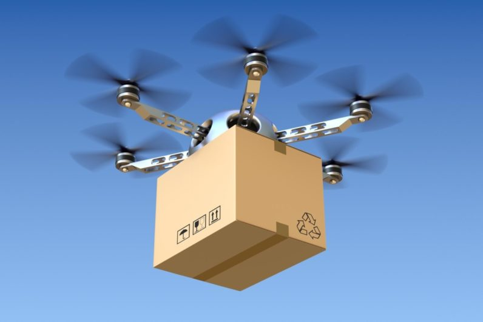
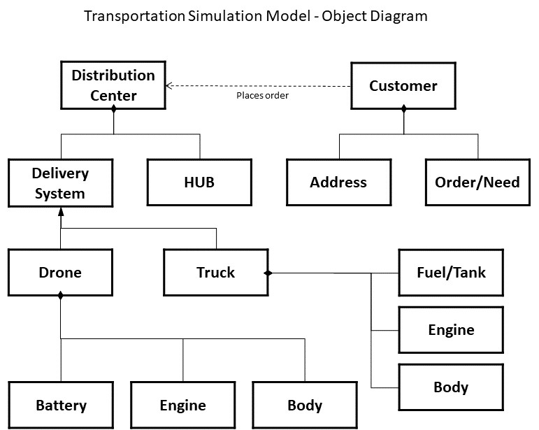
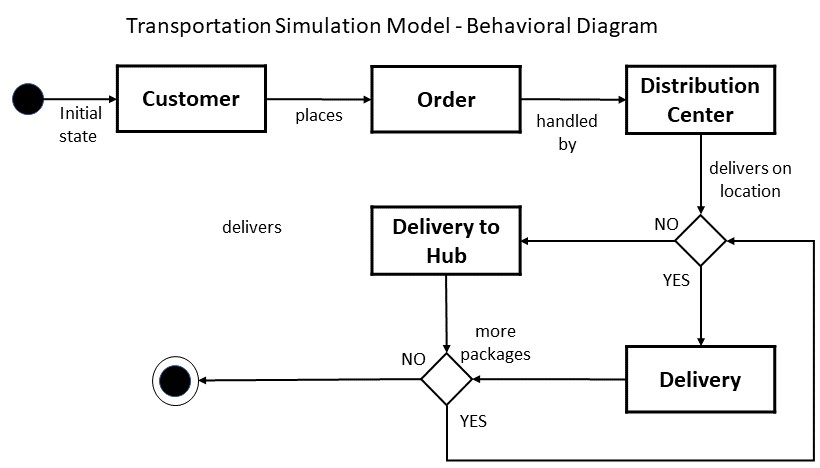

# IDS6145(SimTech 2018) - Research Plan

> * Group Name: Ama-Drone
> * Group participants names: Markus Loennig, Marc Mailloux, Tiffani Marlowe
> * Project Title: Viability of Drone Delivery in Orlando Fl

## General Introduction

Technology and online shopping continues to advance at an instantaneous rate. Consumers are now capable of ordering most anything via the web and therefore, have become reliant on quick and dependable home delivery services. With the online shopping market increasing at a steadfast rate, businesses are now investigating and improving new forms of delivery and their overall efficiency. One of the most recent forms of delivery are via aviation, in particular, by the use of drones.

A "drone" refers to unmanned aerial vehicle (UAV) or unmanned arial system (UAS) that is or can be controlled remotely by an operator on the ground. Currently technology is shifting from controlling to giving it an UAS a task and just monitor it, so no positive control is maintained at all times. This greatly reduces workload o the operators and enables them to operate multiple systems at any given time.  

Traditionally, drones have been utilized within the military for dangerous operations or missions that can be done by soldiers due constrains like flight-time/endurance. However, they are beginning to apply to civil applications such as firefighting and even now, package delivery.  Through the operation of drone delivery, there could be potential for reduced delivery costs, improved customer service and more importantly, accelerated delivery times. 

Which leads us to believe that drones will be a more efficient and especially speedier form of consumer goods package delivery in a exemplary city like Orlando.

The problem we wish to investigate will no doubt be part of the worlds day-to-day living in the foreseeable future. The ability to keep up with developing technology and the adaption of regulations (airspace, legal, insurance, etc.) are already in the works. Many large online retailers such as Amazon and DHL are currently experimenting with unmanned aerial systems in order to provide faster delivery of consumer goods. Amazon plans to implement "Amazon Prime Air" with a targeted delivery time for certain goods in under 1 hour. Based on current technology and consumer needs, we feel this form of delivery will quickly become the next level of packaged delivery.

#### Historical Background:

Before the digital era (Internet) consumer needs were usually satisfied by local department and specialty stores. Uncommon goods were ordered from catalogues either via phone (landline) and/or via a written order (letter). Once the packaged has been processed by the retailer, a distribution center somewhere in the country would further process the order and a mailman would later deliver the package to its destination. Consumers could expect to receive their order within two weeks which was considered normal at the time.

With the coming of the digital era, consumers no longer have to physically go into stores or use catalogues to purchase goods. Instead, they are capable of ordering most anything via online shopping. With these evolving abilities, consumer behaviors and expectations have also changed. They now demand their orders sooner rather than later. This impatience and expectation has only worsened over time. Larger retailers are now forced to manage this decentralized demand by providing quicker and more efficient delivery methods.

One of that largest online retailers, Amazon, has managed to change the worldwide behavior and meet consumer expectations by ensuring everything is connected. Therefore, everything is accessible by the click of a button. Amazon, has continued to decrease delivery times from weeks to now days. They have even gone further enough to shorten the delivery time of certain goods to "Next Day" and most recently to "1 Hour" delivery. They have made this possible by building smart distribution centers in various locations and implementing a highly intelligent delivery process. Without a sound and sophisticated delivery infrastructure, this worldwide success would not be possible.

Amazon and others major retailers are investigating the next step: overcoming the delivery infrastructure and service (like American Postal Service or UPS/DHL) with their own, more efficient and fast system. The newest logical solution lays within air transportation. Its direct and is not dependent upon on street infrastructure or the control of a human. Therefore, the number of employees and the time between package processing and delivery will be decreased. Potentially allowing for greater savings for both the retailer and the consumer.

Drone technology on the other hand has also become more advanced over the past few years, especially better batteries with higher density, improved charging times, more efficient brushless motors and a certain degree of independence to perform a variety of tasks. 

Thus, the capabilities of drones are influencing and expanding the delivery industry. Drone delivery systems are already scalable for different scenarios. Uber is experimenting with drones in terms of a taxi service, which is, from a logistical stand point of view, very similar to a on-time package delivery system. 

#### Problem Statement
Delivery and logistics companies are currently testing drone capabilities to determine the efficiency and effectiveness of drone package delivery. Therefore, it is apparent that delivery (among other areas) via drone technology is something we can expect to see in the future. We propose that a delivery system such as this for at least parts of the city of Orlando Florida could be realistic and the city overall could benefit from this. 

Our research could provide relevant insight into how such a system would have to be designed and how many drones would be neccessary (scale of effort) to service a given area. Additionally, we want to have a look into the future by predicting lower charging times and higher flight speeds. We will simulate the effects this would have on the number of drones and therefore on costs.  want to 

Therefore, we hypothesize:

1.)	Drone delivery will be able to improve delivery time to under one hour (e.g. Amazon Prime Air), given the customer lives within a certain distance to a "delivery hub" and is able to receive a package from a drone. 

2.) Progress in battery development and design for improved speed will significantly reduce the overall number of drones and therefore reduce the logistical footprint and costs for the respective logistical company, making it easier, cheaper and more probable to implement. 

#### Contributions 
•	We have modeled and developed 2 simulations. We use Python and AnyLogic to adress the abovementioned hypothesis.
•	We will provide a comparison of statistics with deliveries with current technologies to those with improved (future) capabilities and their efects on delivery and scale of effort.  
•	We will provide an empirical analysis to further highlight the potential of a future drone based delivery system.
•	We will provide answers to the urgent questions and consumer expectationson on delivery time.

## The Model

After working on both Python and AnyLogic and feedback given by Dr. Kider and the Teaching Assistant (TA), the intended model as depicted below will no longer be used. It seemed like a natural evolution, while working on the actual respective models that easier and better to implement solutions were found. So what is shown here was the intention, which has developed into the adapted models shown below. 
 

As you can see, for the purpose of this experiment we will focus our attention on simulating various input and output variables. For a greater understanding, they are also listed below:
+ transportation type (truck vs drone)
+ drone delivery methods
+ battery life
+ location of drop off destinations (homes)
+ speed of delivery
+ various number of delivery hubs

The purpose of Figure 1 (Transportation Simulation Model – Object Diagram) and Figure 2 (Transportation Simulation Method – Behavioral Diagram) is to provide a depiction of the current problem we are trying to address.

As shown above, Figure 1 describes the various objects in the simulation (delivery system, customer, etc.) and their attributes in which we will be focusing our attention (battery life, location, etc.). Within Figure 2, you can clearly understand the interactions between the variables and how the simulation will be executed. Gathered from the models, you can see that the initial state starts with the customer. They first place an order; the order is then sent to a distribution center where the package will be delivered based on two forms of delivery (drone and/or truck).

## Fundamental Questions
By focusing on these specific variables within the simulation, we aim to answer the following questions below:

1) Is drone delivery more efficient than standard ground based delivery methods? If so,
+ How long does it take (on average) to deliver a package to a certain location by ground and by air?
+ How will efficiency change with increasing number of orders and diversified locations?
+ At what point will the ground based solution be better than the air based solution and vice versa?
+ How long does it take to deliver 50 packages via ground based system?
+ How long does it take to deliver 50 packages via air based system?

2) How does increased battery, max speed, and carrying capacity effect the number of drones needed?
+ How can "Hubs”-like package pick-up stations with a slightly increased delivery time influence the delivery service industry?

3) Can the drones reduce average delivery time by 30%? If so,
+ Taking technical development into account, which overall measurable effects will have changes in delivery speed, battery efficiency and increased payload for air based solutions (e.g. increased possible flight time of 10% / 20%, shortened recharging time, etc.)?

## Expected Results
After creating and analyzing the delivery system simulation, we expect to find air based delivery methods will be more efficient compared to ground based delivery methods. In particular, we believe that drone delivery will be significantly faster and more efficient compared to ground based delivery; perhaps even 30% more efficient. With that being said, we are not sure at what point and what conditions it will take for ground based delivery systems to exceed drone delivery abilities.  Lastly, we expect that battery life and the weight of the packages will have an overall effect on the air delivery systems capabilities.

## Research Methods

In order to address these problems, we will develop and execute an Agent Based Simulation paired with the simulation software Anylogic that represents specific areas of the city of Orlando. Throughout this simulation we hope to evaluate the overall effort needed to partly replace current ground based methods of delivery and meet consumer expectations.

In addition, by applying Agent Based Simulation techniques to model and simulate a specific portion of the city of Orlando we hope to compare the pros and cons of ground based (trucks) delivery methods against air based (drones) delivery methods. Our main effort is to determine the differences among the two delivery methods in regard to speed of delivery, efficiency, and overall performance of the systems. By doing so, we could further determine the quantity of drones and locations it would take to provide an efficient air based delivery system for the city of Orlando.

We plan to have our air or ground based agents delivery x amount of packages with respect to time to determine which is more efficient. Additionally changing certain parameters on the drone(like battery, max speed, carrying capacity) predict completion estimates with newer technology.

## (Other)
(change the title and amount of headers as needed) (mention datasets you are going to use) (mention base code or examples you)

## Discussion
(final only - remove whole section for proposal Readme) (What would you have done differently) (What are the contributions summerize)(what is the big take away)(what did you learn)

## Future Work
(final only - remove whole section for proposal Readme) (if you had 6 more months what would be the next steps in this project.) (What are a few questions you have now)

## References

Campbell, J. F., Sweeney, D. C., & II, Z. J. (2017). Strategic design for delivery with trucks and drones. In Technical Report.

Gulden, T. R. (2017). The Energy Implications of Drones for Package Delivery: A Geographic Information System Comparison.

Thiels, C. A., Aho, J. M., Zietlow, S. P., & Jenkins, D. H. (2015). Use of unmanned aerial vehicles for medical product transport. Air medical journal, 34(2), 104-108.

