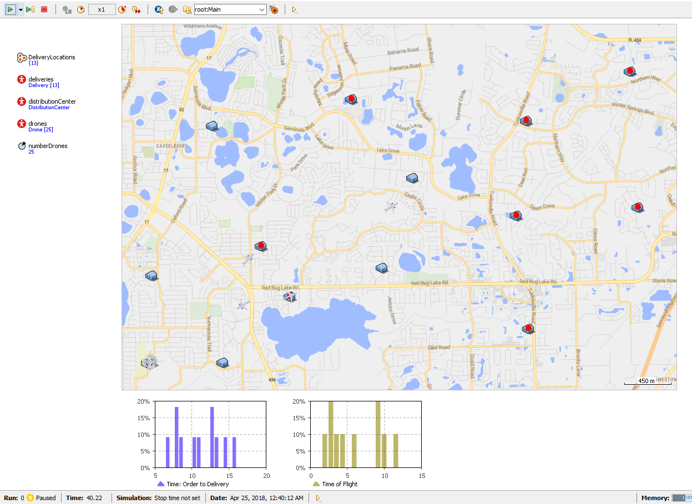
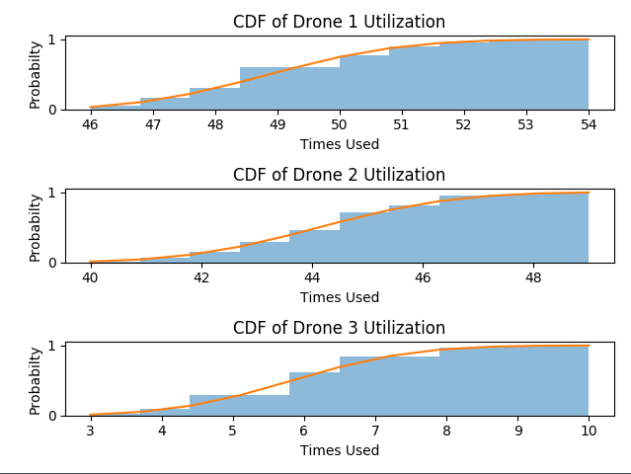
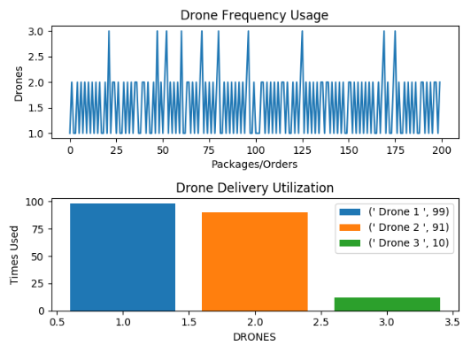

# IDS6145(SimTech 2018) - Research Plan

> * Group Name: Ama-Drone
> * Group participants names: Markus Loennig, Marc Mailloux, Tiffani Marlowe
> * Project Title: Viability of Drone Delivery in Orlando Fl

## General Introduction

Technology and online shopping continues to advance at an instantaneous rate. Consumers are now capable of ordering most anything via the web and therefore, have become reliant on quick and dependable home delivery services. With the online shopping market increasing at a steadfast rate, businesses are now investigating and improving new forms of delivery and their overall efficiency. One of the most recent forms of delivery are via aviation, in particular, by the use of drones.
A "drone" refers to an unmanned aerial vehicle (UAV) or unmanned aerial system (UAS) – meaning while in flight the drone is controlled remotely by an operator on the ground. Currently aviation technology is shifting from typical within cockpit control to UAS. Pilots main task is to monitor the UAV from the ground instead of physically being in control from inside the cockpit. In doing so, the pilot is removed from manual control and systems operations in various scenarios. This ability greatly reduces operator workload and safety while also enabling pilots to operate multiples systems simultaneously.  

Traditionally, drones have been utilized within the military for dangerous operations and missions to limit solider causalities. Drones enables the military to complete missions that otherwise would not be possible due to constrains such as flight-time and endurance. More recently, drones are beginning to be utilized in many civil applications such as firefighting and even now, package delivery.  Through the operation of drone delivery, there could be potential for reduced delivery costs, improved customer service and more importantly, accelerated delivery times. 

The ability to keep up with developing technology and the adaption of regulations (airspace, legal, insurance, etc.) are already in the works. Many large online retailers such as Amazon and DHL are currently experimenting with unmanned aerial systems in order to provide faster delivery of consumer goods. Amazon plans to implement "Amazon Prime Air" with a targeted delivery time for certain goods in under 1 hour. In addition to Amazon, other delivery and logistics companies are currently testing drone capabilities to determine the efficiency and effectiveness of drone package delivery. Therefore, it is apparent that delivery (among other areas) via drone technology is something we can expect to see in the future. We feel this form of delivery will quickly become the next level of packaged delivery throughout the world due to its ability to provide faster and more efficient deliveries. 

#### Historical Background:
Before the digital era (Internet) consumer needs were usually satisfied by local department and specialty stores. Uncommon goods were ordered from catalogues either via phone (landline) and/or via a written order (letter). Once the packaged has been processed by the retailer, a distribution center somewhere in the country would further process the order and a mailman would later deliver the package to its destination. Consumers could expect to receive their order within two weeks which was considered normal at the time.

With the coming of the digital era, consumers no longer have to physically go into stores or use catalogues to purchase goods. Instead, they are capable of ordering most anything via online shopping. With these evolving abilities, consumer behaviors and expectations have also changed. They now demand their orders sooner rather than later. This impatience and expectation has only worsened over time. Larger retailers are now forced to manage this decentralized demand by providing quicker and more efficient delivery methods.

One of that largest online retailers, Amazon, has managed to change the worldwide behavior and meet consumer expectations by ensuring everything is connected. Therefore, everything is accessible by the click of a button. Amazon, has continued to decrease delivery times from weeks to now days. They have even gone further enough to shorten the delivery time of certain goods to "Next Day" and most recently to "1 Hour" delivery. They have made this possible by building smart distribution centers in various locations and implementing a highly intelligent delivery process. Without a sound and sophisticated delivery infrastructure, this worldwide success would not be possible.

Amazon and others major retailers are investigating the next step: overcoming the delivery infrastructure and service (like American Postal Service or UPS/DHL) with their own, more efficient and fast system. The newest logical solution lays within air transportation. Its direct and is not dependent upon on street infrastructure or the control of a human. Therefore, the number of employees and the time between package processing and delivery will be decreased. Potentially allowing for greater savings for both the retailer and the consumer.

Drone technology on the other hand has also become more advanced over the past few years. They are now equipped with better batteries due to higher density, improved charging times, more efficient brushless motors and a certain degree of independence to perform a variety of tasks. Thus, the capabilities of drones are influencing and expanding the delivery industry. Drone delivery systems are already scalable for different scenarios. Uber is experimenting with drones in terms of a taxi service, which is, from a logistical stand point of view, very similar to an on-time package delivery system. 

#### Problem Statement
Based on current technology and consumer needs, we believe that drones will provide a more efficient and especially faster form of consumer goods package delivery throughout the world. Therefore, in this article, we aim to investigate whether a drone delivery system could be realistic and overall beneficial to a larger city such as Orlando, Florida. 

This research contributes to the current technological advancement by providing relevant insight on how a drone delivery system would have to be designed in order to run successfully and efficiently. Our research compares statistics for both current and advanced delivery systems to determine their effects on delivery time and scale of effort. In addition, we provide an empirical analysis to further highlight the potential of a future drone based delivery system and answer to current urgent questions and consumer expectations on delivery time.

By simulating the effects of varying number of drones, charging times, and flights speeds we hope to determine 1) how many drones would be necessary (scale of effort) to service a given area and 2) how cost efficient a drone delivery system would be.

We hypothesize:

1.)	Drone delivery will be able to improve delivery time to under one hour (e.g. Amazon Prime Air), given the customer lives within a certain distance to a "distribution center" and is able to receive a package from a drone. 

2.)	Improved battery life and speed will significantly reduce the overall number of drones needed. Therefore, reducing the logistical footprint and costs for the respective logistical company - making it easier, cheaper and more probable to implement. 

## The Model
In order to represent and depict all aspects of the simulated drone delivery system, we have created (refined from our previous Transportation Simulation Model) multiple Object and Behavioral Diagrams. This enables us to describe both simulations (Anylogic and Python) from a model perspective. Each system offers a unique approach to answering the same fundamental questions stated below.

				Figure 1: Anylogic Object Diagram

		
        		Figure 2: Anylogic Behavior Diagram

Object Diagram (Figure 1) and Behavior Diagram (Figure 2) shown above represent the Anylogic simulation that focuses on answering questions related to drone optimization and utilization from an Agent Based perspective. Figure 1 describes the various objects in the simulation and their attributes in which we will be focusing our attention (battery life, propulsion, etc.). Within Figure 2, the interactions between the variables and how the simulation will be executed is depicted. Gathered from the models, you can see that the initial state starts with the customer. When customers place an order, the order is then sent to a distribution center where the package will be handled and later picked up by a drone to be delivered. Once the drone has delivered the package to the customer, it returns to the distribution center to recharge until the process starts again.

			Figure 3: Python Object Diagram

			Figure 4: Python Behavior Diagram

While the Object Diagram (Figure 3) and Behavior Diagram (Figure 4) shown above represent the Python simulation that focuses on individual drone utilization and efficiency from a Discrete Event system perspective. Within these diagrams, the effects of distance, velocity, and battery life are taken into account when determining drone utilization. As shown in Figure 4, the initial condition is determined by the number of orders, distance, velocity and battery life. Once these attributes are determined, the system decides which drone (1, 2, or 3) is capable to successfully deliver the package. Once the package has been delivered, drones are sent back to the distribution center to be charged for later use. 

Both models have been created based on current delivery technology systems and then tweaked specifically for drone usage. For the purpose of this experiment we focus our attention on simulating various input and output variables within each system. For a greater understanding, they are listed below:

+	drone delivery methods
+	battery life
+	speed of delivery
+	number of drones

## Fundamental Questions
By implementing both an Agent Based (Anylogic – Model 1) and Discrete Simulation (Python – Model 2), we aim to answer each of the following questions below: 
##### 1) Is drone delivery efficient as an air based delivery method? If so,
+ How long does it take (on average) to deliver a package to a certain location by air?
+ How will efficiency change with increasing number of orders and diversified locations?
+ How long does it take to deliver 50 packages via air based system?

##### 2) How does increased battery and max speed effect utilization, arrival time and the number of drones needed?

##### 3) Can drones reduce average delivery time to 1 hour (as intended by Amazon Prime Air). If so, 
+ How many drones are necessary to achieve this?

## Research Methods

To address and answer the fundamental questions above, we have developed and executed an Agent Based Simulation within the simulation software Anylogic and a Discrete Event Simulation in Python. We chose to tackle this topic from two different simulation approaches in order to apply our newly learned skills from class. This enables us to answer each fundamental question about drone delivery that we may have not been able to do otherwise if we only chose one simulation approach. We also wanted to determine whether an Agent Based simulation or Discrete Event simulation provided more realistic and/or user friendly approach to our problem statement. 

We chose a specific area of the city of Orlando for the AnyLogic simulations by using GIS data. Since for our simulation the only GIS value currently needed is distance, we still have more possibilities to built upon in future works with GIS. For Python we used distances. Throughout these simulations we hope to evaluate the overall effort needed to partly replace, or at least improve, current ground based methods of delivery and meet future consumer expectations.

In order to do so, we focused our attention on demonstrating how a drone delivery system would be implemented. This approach enables us to determine which scale of effort is needed and also define the quality and quantity of drones it would take to provide an efficient air based delivery system for the intended area. Changing certain parameters on the drone such as battery density, endurance, max speed, charging time, etc. can all help to predict completion estimates for newer technology.

To successfully model a simulation that would answer the fundamental questions above, we had to define certain prerequisites and assumptions beforehand. We defined these prerequisites and assumptions based on the drone market screening we gathered. To meet our expectations and improve the overall validity of the system we chose to use a drone created by DJI company. This company is one of the worlds leading civil drone manufacturers and, with the chosen drone, offers the best compromise between carrying power, in other words how much weight it can transport and lift combined with good endurance. Endurance is an important element within our simulation as it helps define the reach of the drone and overall radius.

The drone model we chose to base our prerequisites and assumptions on is the DJI Matrice 600 (matrice multiplication which is by pure coincidence the mathematics behind our Python simulation, no pun intended). The Matrice 600 model is built and used for professional users because it is highly reliable, offers a high amount of documentation, offers precise location of coordinates due to its sensor layout (a prerequisite in unmanned/unmonitored flying), its ability to carry up to 5.5kg (12.1 lbs, max.) and ability to travel at speeds up to 40 knots. This translates to 40 mph when there is no wind. Due to its retractable landing gear, it could also carry light, oversized packages proving to be an excellent model for our simulations.

For more information on the Matrice 600 drone technical specs, see: https://www.dji.com/matrice600 

To further validate our simulations and provide more realistic data in terms of package weight, size and delivery time, we completed a survey that compared the last 10 Amazon orders from 4 individuals each. In doing so, we concluded that the average package size for delivery is about 10x5x8 inches in length (min size: 5x5x5, max size: 17x10x11) for packages that weighed 4 lbs or less. Average delivery time was 2.0 days (all are "Prime" users). We focused on packages of this weight to replicate the assumed simulated drone max carrying weight of 4 lbs. For the purpose of the simulation, everything above this weight limited will not be offered for “Air Delivery” and has to be delivered by ground means.

						 Image 3: Matrice 600 Spec Data

#### Prerequisites 

Gathered from the Matrice 600 spec data (shown above: Image 3) and package survey data, we have compiled a list of prerequisites and assumptions that apply to the AnyLogic and Python simulation. Within each of the two models, specific parameters and assumptions have been set to improve system validity and overall system design. Each of the prerequisite and assumption listed below have been met and applied before running the simulations. 

+ Drones fly with an average of 50 ft/second (15m/sec). This counts in drone acceleration and deceleration.
+ Drones are equipped with the TB48S battery configuration. This allows for 30 minutes of endurance for a 4.4 lbs payload/package.  
+ Due to the aforementioned prerequisites, maximum "one-way" range is limited to 17 miles - allowing for an effective roundtrip radius of 8.5 miles.
+ Recharging battery time for a complete charge is set to 90 minutes (based on 0% to 100%).
+ Drones will be recharged to full capacity after each flight, regardless of the travelled distance and available battery life.
+ Recharge time roughly represents the flight time by a factor of 3. Meaning, a flight time between 3-6 minutes will require a recharging time of 9-18 minutes. 
+ Drones will fly “uncontrolled”. Meaning, there will be no transmission range implemented. Instead, drones will be programmed with address coordinates and flight obstacles (flight profile) prior to the start of the simulation. This capability is one of the advantages of this drone. We are deliberatly ignoring the legal aspects for this method.

#### Assumptions

+ The effective time from order to loading the drone is a triangular distribution with an average of 7 minutes (minimum of 3 minutes; maximum of 12 minutes). 
+ Unloading a package at the destination is a uniform distribution between 20 and 45 seconds. 
+ No package is heavier than 4 lbs.
+ To provide various distances for the drones to cover and deliver to, the data set in AnyLogic is equipped with 13 different addresses (via GIS data) that vary in distance.
+ There is one distribution center that prepares the packages and houses the drones
+ The distribution center is responsible for the depicted area that has a diameter of 14.2 miles. We have chosen a smaller than possible (17 miles) diameter to allow room for additional measures such as wind (even minor wind speeds can have huge effects) and potential package drag. 

							
                         			 Image 4: Drone Delivery Area

For the purpose of both simulations, we have used a quarter of the depicted area shown in Image 4 and Image 5 since direction has no real effect on the drone's abilities. An address provides the drone with one important parameter for the simulation, distance. This then translates into flight time, which is the limiting factor for the drone, thus determining the respective recharging time necessary for delivery. 

                         			 Image 5: Drone Delivery Simulation Area (AnyLogic(GIS))

Since Python is not utilizing GIS map data, the distribution of delivery adresses translate into distance from the delivery center. Even though the AnyLogic image seems more comprehensible, both approaches fulfill the needed functionalities. Main difference between the appoaches are the added functionality of the GIS map, where as for Python, it is easier to change the distance or number of the delivery points. Even though this is not an integral part of the final project, we value these insights. 

                         			 Image 6: Drone Delivery Simulation Area (Python)

#### Research Simulation Design: Anylogic

Below is the simulated design process for the AnyLogic Model. For the purpose of the first simulation runs of this model, the simulation starts with 5 / 8 / 11 drones for a runtime of 600 minutes (10 hours). Within this runtime, there is only 1 order per household (HH) per hour (13 orders/hour) for the area. Here, we aim to determine how drone utalization and optimization varies based on package amount.

For the following and further simulations, we change the speed (in the images below as: "fast") and shorten the charging times of the batteries ("charge"), as this is currently the limiting factor on usage. Lastly, both changes/improvements will be implemented ("both") simultaneously and analyzed.

- "fast": the speed will be adapted from currentyl 34 mph (50ft/sec) to 60 mph (88ft/sec, 29m/sec). Some modern drones can achive that speed and are foreseen to be faster, depending on the type of drones and propulsion. 
- "charge": the charging time will be reduced by 1/3, so now a full charge can be done within 60 minutes (instead of 90 minutes).
- "both": both above described improvements are being implemented into the drone simulation. 

All other values (houses, number of drones, ...) will remain the sane as the first half of the simulation to be able to compare the impact of the attributes Speed and Charge.

Multiple videos of the simulation have been provided below for more insight into each simulated run.

- The process for 1 order/HH/hour with can be seen here: 
	+ https://youtu.be/fzb6oUqDDWY
- 1 order/household/hour  with  5 drones:  utilization 96%,  53 deliveries, of which 21 take longer than 1 hour, 6 even longer than 90 minutes
	+ https://youtu.be/HbHV2XxcoAI
- 1 order/household/hour  with  8 drones:  utilization 95%,  81 deliveries, none took longer than 1 hour
	+ https://youtu.be/rOAO5Jfjz04
- 1 order/household/hour  with 11 drones:  utilization 81%,  94 deliveries, none took longer than 40 minutes
	+ https://youtu.be/vtBSfUZnuog

- The next simulation runs double the number of orders to 2/HH/hour. With 16 and 18 drones the simulation reaches a utilization of 92% and 83% respectively, of which 92% is above the given threshold for the optimization process assigned in Anylogic (see the Results: AnyLogic section below). 
	+ 2 orders/HH/hour with 16 drones: https://youtu.be/uKgUKagtmTc
	+ 2 orders/HH/hour with 18 drones: https://youtu.be/in5Zay7Dtjw 

#### Research Simulation Design: Python

Below is the simulated design process for the Python Model. For this purpose of this model, we began our simulation by creating a distance function that generates distances in miles on a constrained Grip Map. The Euclidian Distances are then calculated and stored along with a list of x and y coordinates. Additionally, we created a Speed function that is able to adjust the velocity depending on distance. Lastly, we developed a battery initializing function that creates an array of battery charge for each drone used.

This function starts off by creating the necessary constraints - using Time equal to distance over Velocity. Using this newly calculated array we can simulate each delivery by taking into consideration the flight time with respect to the battery life and capacity. This allows us to monitor the battery life. If battery life was at half capacity or lower, another drone would be sent out for delivery, and the rest of the drones will be sent to the distribution center to charge. Various statistics are then accounted for and collected. A Monte-Carlo Simulation is set-up and ran for a number amount of trials to further provide a a variety number of statistics.

			Image: Map of Randomly places "homes"

For additional insight into the python coding process, see the code and images file located here: [**Python Code**](code/README.md)

## Results:

##### Model 1 Results: Anylogic (Summary)

The data created for drone delivery utilization, optimization, and time for 1-, 2-, and 3- orders/household(HH)/hour in the Anylogic Model were analyzed with a within-subjects design. Where the number of drones first varied from 5, 8, and 11 for 1 delivery per household (HH) and  hour in an trial and error approach, later simulation runs where based on the in-build optimization tools provided by AnyLogic. For that, we have created an "Optimization Experiment" which made it relatively easy to find the "best order to drone" ratio, based on the drone utilization rate of 85%. A higher utilization rate is highly unrealistic for aviation. 

After running the simulation, statistics reveled different values and statistics for the different numbers of order/HH/hour, with 
+ 1 order/HH/hour has an optimum of 11 drones for a utilization rate = 81%, fulfilled deliveries = 94, and a max delivery time < 40 minutes. 
+ 2orders/HH/hour with an optimum of 18 drones have a utilization rate = 85%, fulfilled deliveries = 164 and a max delivery time < 30 minutes. 
+ 3/HH/Hour has an optimum number of 25 drones for a utilization rate = 85%, fulfilled deliveries = 217 and a max delivery time  < 28 minutes.

Interestingly, the number of necessary drones do not raise in equal conjunction with the raised drones/HH/hour. To fulfill the double amount of orders (from 1 to 2 order/HH/hour) a raise in number of drones of 61% (from 11 to 18) is sufficient. The same is true for the raise to 3 orders/HH/hour with another 7 drones (instead of 11). The higher the amount of orders/HH/hour becomes, the less drones will become neccessary with each additional step. Even though we have not looked into higher numbers of orders in detail, for a 4 orders/HH/hour delivery density the number of drones needed (for an 85% utilization rate) is 27, whereas for 5 orders/HH/hour the number raises to 33 (which is only 3 times the numbers needed for 1 order/HH/hour). This shows that a certain threshold of numbers as a minimum basis has to be overcome. Smaller systems are more costly (less cost efective) and more prone to failures and problems. Larger systems are able to buffer failures and problems more reliably.  

As stated above, an utilization of over 85% is unrealistic, especially in aviation, due to planned and unplanned maintenance. It also has to include some reserves for a possible (unexpected) higher package order rate during peak times. Therefore, the optimization process we used aimed for 85% and is shown in Figure 1. This is the optimization functionality included in AnyLogic, mentioned several times earlier, and was used for all our scenarios. This optimization experiment functionality was one of the revelations we were able to take away from this project. 

				Figure 1: Optimization  process for 85% threshold

For our simulation runs with 1 order/HH/hour and the trial and error approach (before utilizing the optimization experiment) the formulated goal (utilization of over 85%, low delivery times) could not be met with 5 and 8 drones. Results showed that due to the high utilization rate there was no time to accept sufficient orders. With 5 drones in use, only 53 packages were delivered, and half of those with a delivery time of ober 1 hour. The "optimized solution" was able to generate 94 deliveries with 11 drones, and all delveries within 30 minutes. 

All 2 orders/HH/hour package deliveries, with the calculated utilization rate of drones of below 85%, were completed within 30 minutes of the order, which shows the potential of drone based delivery systems. The optimum number was 18 drones (as opposed to 11 for 1 order/HH/hour)

Interestingly, for 3 orders/HH/hour the number of drones doesn't necessarily raise equally to the magnitude of orders. And the test results of the simulation runs show that the optimization tool is correct with its result of 25 drones. Even simulations with significantly more drones (runs were simulated with up to 45 drones) don’t show any significant differences between number of orders served or service time until delivery. The only difference is the utilization time, which drops significantly and is therefore logistically and economically counterproductive (as it is a cost-driver).

##### For the improvement simulations (speed, charge, both):

We believe that technology will improve certain aspects of the current drones and have put this expected development into our simulations. We focussed on improved speed and rechrging time. 

There are significant effects on drone delivery time and neccessary number of drones based on both drone speed (normal, fast) and battery charge. These statistics revealed that a faster speed (60 mph) reduces drone delivery time for the 1 order/HH/Hour by 39%, the 2 order/HH/Hour delivery time reduction is 30%), and the 3 order/HH/Hour delivery time reduction is 9%.  

The change driven by shortened charging times is mainly the number of drones needed. Just the improvement of charging reduces the numbers for 1 order/HH/hour from 11 to 9 drones (19% less), for the 2 orders/HH/hour it is reduced from 18 to 17 ( 5.5% less) and for 3 orders/HH/hour the number is reduced form 25 to 19 (24% less).   

Further inspection of these results revealed that implementing “both” improvements (faster speed and less charge time) for each package amount reduced mean time and max delivery time, 1 order/HH/Hour (reduced mean time = 37%, reduced max delivery time = 54%), 2 order/HH/Hour (reduced mean time = 29%, reduced max delivery time = 43%), and 3 order/HH/Hour (reduced mean time =21%, reduced max delivery time = 32%). Results and descriptive statistics for each package order amount (1, 2, 3) are shown in Figure 2, 3, and 4.

For a further breakdown of the statistics, the changes in the values of charging time, speed and both are described and summarized here. Even though the optimization run suggests changing the number of drones, we left them deliberately at the "normal" value to see the difference in the simulation and the effects of the implemented chages. 

##### AnyLogic: Results for 1 Order/HH/hour

Figure 2 shows the effects on 1 order/HH/hour for the given area and 11 drones. The optimization process shows the variations in necessary drones:  

  - 1_11 (normal)optimal number of drones: 11      
  - 1_11fast 	optimal number of drones: 12     
  - 1_11charge 	optimal number of drones: 9      
  - 1_11both 	optimal number of drones: 9      --> thats a change of 19% from normal to both

				Figure 2: 1 order/HH/Hour 11 drones

The first striking difference (on the right side), as to be expected - the flight time is almost reduced to half. This is logical as the speed almost doubled (34mph --> 60mph). The effect of the increased speed on delivery time is also significant with a mean from 17.7 minutes to 12.5, which is a reduction of almost 30%. The reduced charging time shows its effect on the max delivery time value, as it is also significantly reduced from 37.6 to 22.9 minutes. This is a reduction of 39%. Obviously, implementing both improvements reduce the mean and the max delivery time again, as both can have cumulative or subsidiary effects. Implementing both improvements reduce mean time by 37% and the max delivery time even by 54%. 

##### AnyLogic: Results for 2 Orders/HH/hour

Figure 3 shows the effects on the 2 order/HH/hour for the given area and 18 drones. The optimization process shows again positive variations in necessary drones (decreases to 15, which equals a 17% reduction):  

  - 2_18 (normal) optimal number of drones: 18      
  - 2_18fast 	optimal number of drones: 16     
  - 2_18charge 	optimal number of drones: 17     
  - 2_18both 	optimal number of drones: 15     --> thats a change of 17% from normal to both

				Figure 3: 2 order/HH/Hour 18 drones

Again, we left the number of drones at the "normal" number of drone value to see the difference in the simulation. As shown in Figure 3 below, the flight time is almost reduced to half. This will always be the case because it is logical as the speed almost doubled (34mph --> 60mph). It will not be mentioned in further discussions. The effect of the increased speed on delivery time in a higher number environment, with more drones and more orders shows again improvements on the mean delivery time from 15.6 minutes to 13.2, which is a reduction of almost 16%. The reduction is smaller, but so is the mean time to begin with. This seems to be a normal effect, as smaller numbers are less tolerant to outlying behavior or problems. In fleet management this is the so called "curse of small numbers".  The reduced charging time again shows its effect best on the max delivery time value, as it is reduced from 31 to 21.7 minutes. This is a reduction of 30%. Implementing both improvements reduce mean time by 29% and the max delivery time by 43%. 

##### AnyLogic: Results for 3 Orders/HH/hour

Lastly, Figure 4 shows the effects on 3 order/HH/hour and 25 drones. The optimization process shows again positive variations in necessary drones (decreases to 18, which equals a 28% reduction) for a targeted utilization rate of 85%:  

  - 3_25 (normal) optimal number of drones: 25      
  - 3_25fast 	optimal number of drones: 25     
  - 3_25charge 	optimal number of drones: 19     
  - 3_25both 	optimal number of drones: 18     --> thats a change of 28% from normal to both!
  

				Figure 4: 3 order/HH/Hour 25 drones

The effect of speed increase on delivery time in an even higher number environment, with more drones and more orders shows again improvements on the mean delivery time, here from 14.2 minutes to 11.4, which is about 20%. This reduction is somewhat higher than for the 2_18 simulation, but it seems to be a normal variation. This seems to be a normal effect in general, as smaller numbers are less tolerant to outlying behavior or problems. 

The reduced charging time shows its effect best on the number of drones needed. This was not expected as it did not show this drastic cut in the other scenario (2 orders/HH/hour) above. Economically, this alone has a huge effect on the scale of effort and costs, as is cuts the number of necessary drones by 24% (25 --> 19) and has therefore the highest impact for this scenario.The max delivery time value is also reduced somewhat from 25.7 to 23.3 minutes, but it is only a minor reduction of 9%.  
Implementing both improvements reduce mean delivery time from 14.2 to 11.2 minutes (21%) and the max delivery time from 25.8 to 17.6 minutes (32%), which is significant. 

The number of drones necessary for a 85% utilization rate drops to 18, which means an improved drone can raise the efficiency of an drone based delivery system by 50% (under observed circumstances and assumptions) as 18 drones are the optimum number for an unchanged drone system to handle 2 orders/HH/hour. The improved drone can handle 3 orders/HH/hour with the same number of drones. That is a significant finding.

Video with statistics for 3_25_both on:   https://youtu.be/Bg6cD1Y4d-0

##### Model 2 Results: Python

Unlike the Anylogic model, this model approaches the drone delivery system from an individual drone efficiency perspective based on battery charge, velocity, and the number of package deliveries.  Drones are sent out for delivery throughout the day and whenever their battery life was depleted, another drone would be sent out while the first drone recharged. Implementing a time array and battery charge equation, we were able to vary the time it took for a drone to deliver a package based on different customer locations and drone battery life. We created the simulation using a within-subject design based on 100, 1,000, and 10,000 runs and varied the number of packages being delivered (100 or 200) to determine how often drone 1, 2, and 3 were used for delivery. To provide more insight for each run, we have created multiple graphs to represent basic statistics (min, max, average), CDF, PDF, frequency utilization rate, and distance traveled in miles. These images can be found here: [**Python Images**](images/python/README.md).

After running the simulation for 100 times for 100 packages, we found that drone 1 usage was slightly higher than drone 2 usage, but significantly higher than drone 3 usage (shown in Figure 5 below). The next scenario simulated 100 runs for a total of 200 packages and showed similar results. Drone 1 and 2 were similar in usage (99 times, 91 times), while drone 3 was briefly used (10 times). Shown in Figure 6 below.

				Figure 5: 100 Runs with 100 Packages

				Figure 6: 100 Runs with 200 Packages

## Discussion

Through the use of both simulations (Anylogic and Python), we were able to answer many of our fundamental questions stated above. Through the Anylogic simulation we found that drones can successfully offer an efficient and conveniently fast alternative to current package delivery systems today.  In particular, based on the number of drones and the criterias previously stated, drones on average can deliver packages under 4lbs in 30 mins. This is when the optimal number of drones is found for the actual demand with a utilization rate less than 85%. As in every logistical process, this requires research and sound calculation basis to calculate the actual needs. 

Through the use of an agent-based simulation we were able to calculate various real-world scenarios, such as how long it would take to deliver 50 packages via the air based delivery system. Our results showed that the rate of incoming orders to the distribution center has a large effect on the capabilities of the system but that delivering large quantities of packages are still possible. As of now, only smaller packages can be delivered this way and the customer has to provide an environment that permits drones delivery (large enough landing space). To further test this theory, we found that an incoming rate of 3 orders/HH/Hour for 25 drones, would take approximately 140 minutes to deliver 50 packages. In addition, we were able to reduce average delivery time to 1 hour, as intended by Amazon Prime Air, but the ability to do so is strictly dependent on the number of orders the system is prepared for.  If there is a limited number of drones available than the ability to deliver multiple packages within a given timeframe is impacted.

In addition to the number of drones available, the battery charging time and speed of the drone also impact the utilization and success of the system. With greater battery capability there is less time needed for charging and thus less drones required at one distribution center. With higher speeds, drones are capable of delivering packages at a much more efficient rate. This was apparent in each of the runs, especially where both speed and battery charge were improved, leading to mean delivery time and the number of drones needed being significantly reduced.

In the military, drones are utilized in a specific way. While one drone is heading into the field, second drone is returning and a third is in the shop recharging. This allows for around the clock utilization and overall system efficiency. By running the python simulation in a similar fashion, we were able to replicate a common real-world application. Gathered from the results, we were able to determine that drone 1 is utilized more often than drone 2 and 3 in multiple scenarios. Providing more insight into the utilization and applications of drones. 

As we have shown, overall drone delivery efficiency is associated with the numbers of orders placed in a given timeframe and the locations of drop off. Therefore, there are limitations to this system if there are not an appropriate number of drones available. We found the number of packages and orders has an immediate effect of the number of drones needed to fulfill orders within a specific timeframe. For example, in example 1 order/HH/Hour with 5 drones, we found there is a certain point when orders can no longer be fulfilled under an hour due to an influx of package orders. However, this limitation can be easily accounted for through simulation. As long as there is an appropriate number of drones available for a specified location and distribution center, the ability to delivery packages via air is plausible. 

## Future Work
This experiment has explored the possibility of implementing a drone air-based delivery system in the city of Orlando. We observed the effects of system efficiency, optimization and utilization based on various drone and package attributes such as number of drones available, speed, battery charge, and weight. These mechanisms will more than likely become an option for package delivery in the future. Through the use of simulation, we were able to determine how useful a drone system would be. With that being said, had we been allocated more time we would have incorporated additional elements to further replicate a real-world scenario. For example, we would have look at the effects of time of day/week and weather on overall drone delivery time.  We feel these elements alone would affect the efficiency of the drone delivery system and would determine how many drones would be needed given certain times of day/week. Poor weather would limit the number of packages being delivered and the time it takes to deliver a package.

We believe that drone delivery will be significantly faster and more efficient compared to ground based delivery; perhaps even 30% more efficient. Therefore, we would also look into comparing drone routes to ground based delivery routes to determine which approach is more efficient. With that being said, we are not sure at what point and what conditions it will take for ground based delivery systems to exceed drone delivery abilities.  We would have to also account for the time of day/week, traffic, etc. to provide a realistic comparison of the two delivery methods.

Lastly, had we more time we would also look into various other drone models to compare capabilities and determine which model would be more suitable for a city similar to the size of Orlando. A drone life expectancy may vary based on its capabilities and technological advancements. After 6 months, we could determine which models offer longer life expectancies when used multiple times every day. Comparing various models would also enable us to determine which model and approach is more cost efficient for both the consumer and retailer. Therefore, this information could be used by many retailers and larger corporations when deciding whether or not to implement a drone air-based delivery system.  

## References

Campbell, J. F., Sweeney, D. C., & II, Z. J. (2017). Strategic design for delivery with trucks and drones. In Technical Report.

Gulden, T. R. (2017). The Energy Implications of Drones for Package Delivery: A Geographic Information System Comparison.

Thiels, C. A., Aho, J. M., Zietlow, S. P., & Jenkins, D. H. (2015). Use of unmanned aerial vehicles for medical product transport. Air medical journal, 34(2), 104-108.

https://help.anylogic.com/index.jsp?topic=%2Fcom.anylogic.help%2Fhtml%2Fgis%2Ftutorial%2FSupply+Chain+GIS+-+Phase+1.html

https://www.anylogic.com/resources/educational-videos/delivery-fleet-optimization-with-gis/
