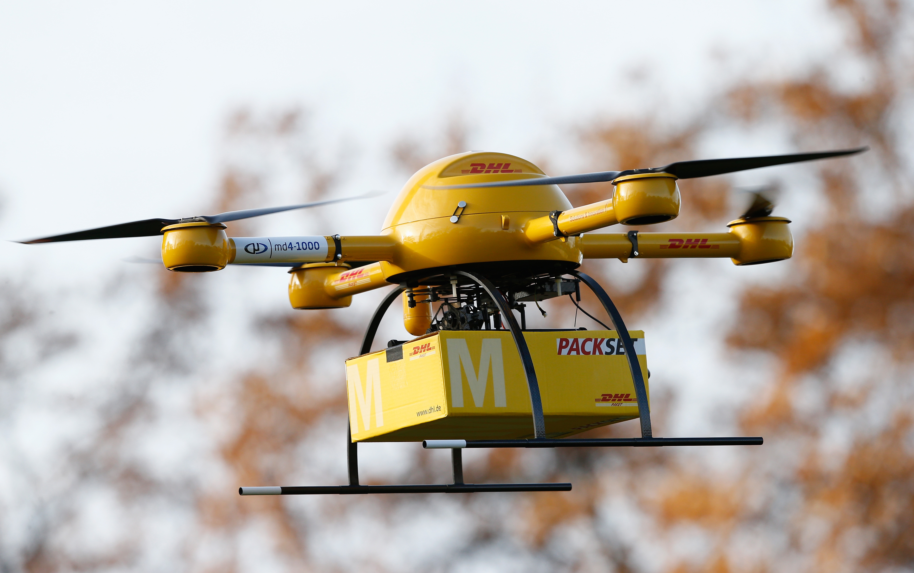

# IDS6145(SimTech 2018) - Research Plan

> * Group Name: Ama-Drone
> * Group participants names: Markus Loennig, Marc Mailloux, Tiffani Marlowe
> * Project Title: Viability of Drone Delivery in Orlando Fl

### Pitch

1.What is the topic?

The topic is dealing with the issue of delivering consumer goods in our target city Orlando.

2.What do you want to do?

We want to model a part of the city of Orlando and simulate the differences between ground based (trucks) and air based (drones) delivery methods. Our main effort is the air based delivery method in regards to speed of delivery, efficiency and overall effort of the system (quantity of drones, quantity and location of hubs).

3.Why is important?

Current consumer behaviors indicates the active buying patterns are becoming more decentralized (ordering online) and we want to see if we can integrate this new concept of delivery into the exisiting infracture.

(TEASER IMAGE HERE - should wow me to read your work)

* (this Readme should "evolve" over time as you add and edit it)
* (once you are happy with it - copy it into the proposal directory, and remove the obvious sections that should be removed - Future work, etc)

## General Introduction

(States your motivation clearly: why is it important / interesting to solve this problem?)
(Add real-world examples, if any)

(Put the problem into a historical context, from what does it originate? Are there already some proposed solutions?)

(You should begin by introducing your topic. In this section, you should define the core terminology specific to the field, introduce the problem statement, and make clear the benefits (motivate!) of resolving that problem statement. The main difference between the ABSTRACT and Introduction sections is that the abstract summarizes the entire project, including results, whereas the introduc-tion only provides the motivation of the problem and an overview of the proposed solution.)

(I tell sutdents to answer the questions, one paragaph each to start if you are lost)

(Problem Statement. One paragraph to describe the prob-lem that you are tackling.)

It is apparent that drone technology is something we can expect to see in the future. Delivery/logistics companies are currently testing drone capabilites to determine the effectivness of drone delivery. 

(Motivation. Why is this problem interesting and relevant to the research community?)

Drone technolgy has become more advanced over the past few years from better batteries to more efficient brushless motors. Thus the capabilities are of drones are expanding like in the delivery industry. Additionally consumer trends are becoming more decentralized with the need for faster and more efficient delivery methods. For example Amazon has a service called Amazon Prime Air which allows the users to order items and have them deliverd in under an hour. A service like this will open up the markets for drone delivery resulting in less overhead for both the customer and drone delivery company. Lastly Uber is a company that is experimenting with using drones as a taxi service, which is very similar to a package delivery system. This shows that drone delivery systems are scalable for different scenarios. Standard ground based delivery systems will eventually be out dated and through this simulation we hope to prove this.

(Proposed Solution. How do we propose to tackle this problem (that has been identified in the previous para-graphs, is interesting to the community, and has yet to be tackled by other researchers)?)

The proposed solution is to simulate the truck and drone delivery methods to home locations or delivery hubs. We intend to use Agent Based Simulation techniques blah blah blah

(Contributions. An enumeration of the contributions of the senior design project)

(This project makes the following contributions:)(you must have this!!)
•	(Contribution 1)
•	(Contribution 2)

## The Model

(Provide structural and behavior diagrams of the system you wish to study.) (Why is your model a good abtraction of the problem you want to study?) (Are you capturing all the relevant aspects of the problem?) (Use the model to tell us what is going on.)

(explicitly list your requirements of what the model will have and simulate for the proposal)

## Fundamental Questions
(At the end of the project you want to find the answer to these questions) (Formulate a few, clear questions. Articulate them in sub-questions, from the more general to the more specific. )

How many drones does it take to out perform standard ground based delivery methods. 

## Expected Results
(What are the answers to the above questions that you expect to find before starting your research?) (This changes from Expected (Proposal) to just Results (final report)) (you should verbally define them) (sketch a few graphs of what you are roughly going for - not the data but histogram of this, line graph of that, screenshot of an agent - use paper and pencil sketches)

## Research Methods
(Cellular Automata, Agent-Based Model, Discrete Event Continuous Modeling...)(Python or Anylogic) (If you are not sure here: 1. Consult your colleagues, 2. ask the teachers, 3. remember that you can change it afterwards) (Steps in the process)

The research methods we plan to use are Agent-Based modeling paired with the simulation software anylogic. We plan to have our air or ground based agents delivery x amount of packages with respect to time to determine which is more efficient. Additionally changing certain parameters on the drone(like battery, max speed, carrying capacity) predict completion estimates with newer technology. 

## (Other)
(change the title and amount of headers as needed) (mention datasets you are going to use) (mention base code or examples you)

## Discussion
(final only - remove whole section for proposal Readme) (What would you have done differently) (What are the contributions summerize)(what is the big take away)(what did you learn)

## Future Work
(final only - remove whole section for proposal Readme) (if you had 6 more months what would be the next steps in this project.) (What are a few questions you have now)

## References
(Add the bibliographic references you intend to use)  (Code / Projects / blogs / websites / papers...)
=======
